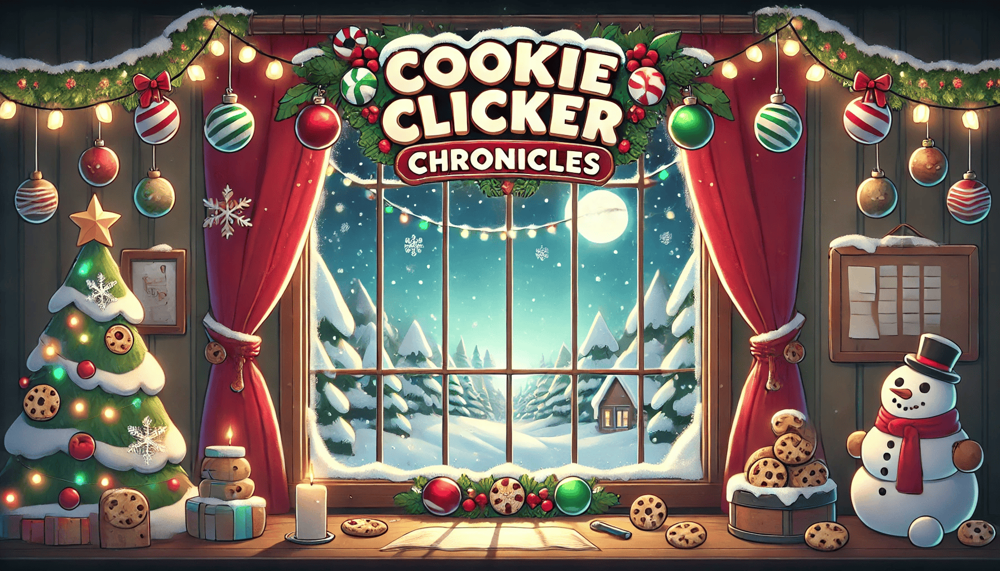
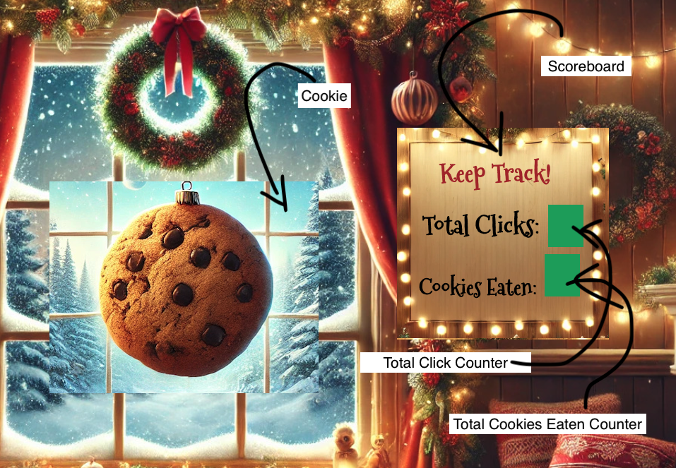
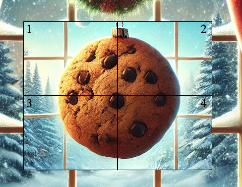

#  Cookie Clicker Chronicles
##  by Abdullah Durrani

#### *** I had to move a few images out of their respective folders into the main src folder because githhub pages had isses rendering the images.

 

##  Acknowledgments

## * All the images in this project were generated by using DALL-E and some of these images were spliced together using the 'Preview' application in macOS.

### I greatly benifted from using ChatGPT partcularly with understanding CSS media queries and rounding out the sound functionality through Javascript.

### MDN Web Docs, Stack Overflow, W3Schools were used relentlessly.

## To the best of my knowledge, all other code in this project is original and was written specifically for it.

 

##  Synopsis: 

### In this game, elves are developing a revolutionary cookie dough called "SantaSynth," designed to interact with Santa's unique genetics. This cookie dough magically disappears when eaten, providing all the joy of snacking without any calories or unhealthy side effects. Players click on cookies to 'eat' them, helping the elves test and perfect SantaSynth. Once enough cookies are consumed, confirming the dough's safety, the elves plan to replace the world's cookie supply. This ensures that when Santa eats cookies made from this dough, they won't affect his health.

 

##  HOW TO PLAY:

#### The initial game screen shows a picture of a cookie and a score board to the right as depicted in the image provided:

#### 1. You click on the 'Cookie'.
#### 2. The Scoreboard keeps track of 'Total Clicks' and 'Cookies Eaten'
#### 3. One rotation of the cookie (all four quadrants being clicked) incirments 'Total Cookies Eaten Counter' by 1.
#### The goal is to eat as many cookies as you can in the time alloted.

##  HOW IT WORKS:

#### The Cookie is broken up in to four quadrants using CSS Grid:

    .grid-container{
    display: inline-grid;
    width: 20%;
    height: 300px;
    grid-template-columns: repeat(2, 1fr);
    margin-top: 268px;
    margin-left: 800px;
    background-image: url('/src/cookie-image/cookie-img.png');
    }

    .grid-items {
    margin: 0;
    border: 1px solid black;
    font: 1em; 
    }

    #quadrant-1 {
    padding-left:5px;
    font-size: 1.5em;
    background-size: cover;
    }

    #quadrant-2 {
    display: flex;
    justify-content: flex-end;
    padding-right: 10px;
    font-size: 1.5em;

    }

    #quadrant-3 {
    padding-left:5px;
    font-size: 1.5em;
    }

    #quadrant-4  {
    display: flex;
    justify-content: flex-end;
    padding-right: 10px;
    font-size: 1.5em;
    }

#### * The 'flex' display in quadrant 2 and 4 is there primarily to make the numbers visible during this display.

